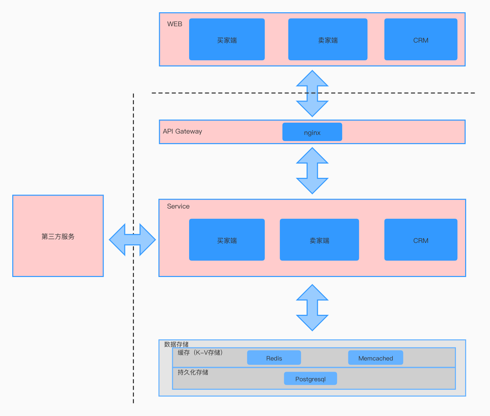
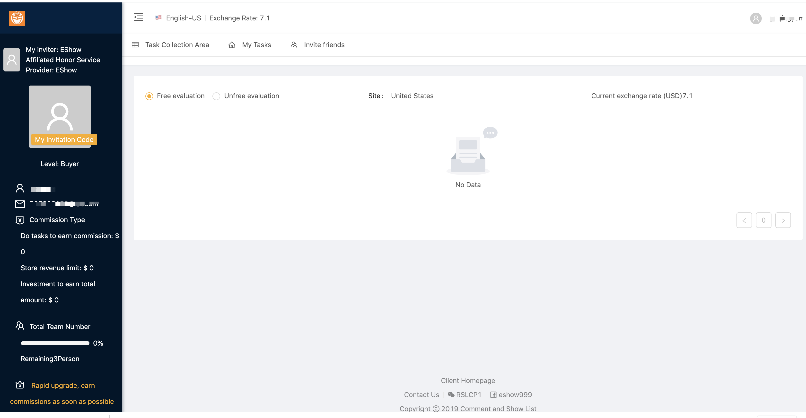
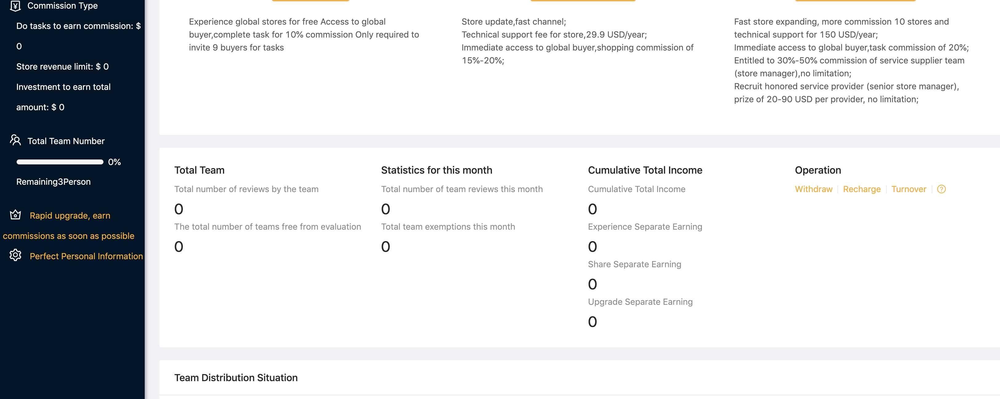
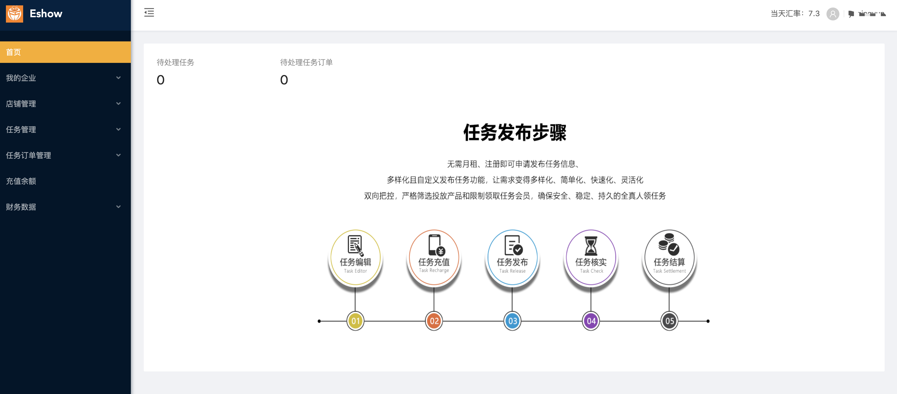
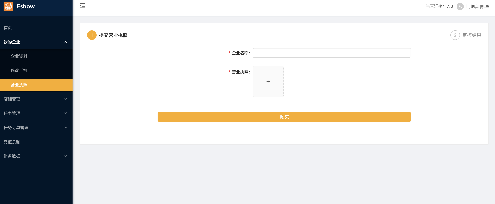

# Eshow

## 应用场景
eshow是一个亚马逊线上测评平台,亚马逊商家可以在该平台上发布任务,测评手可以在该平台上领取任务帮助商家完成测评,以获取相应的报酬.

## 相关技术

* 后台语言: Java 8
* 前端: Vue
* 数据库: Postgresql
* 后台框架: Springboot

## 架构

## 项目地址

* 卖家端：https://seller.eshow999.com/
* 买家端：https://buyer.eshow999.com/

## 项目预览

* 买家端

* 卖家端

